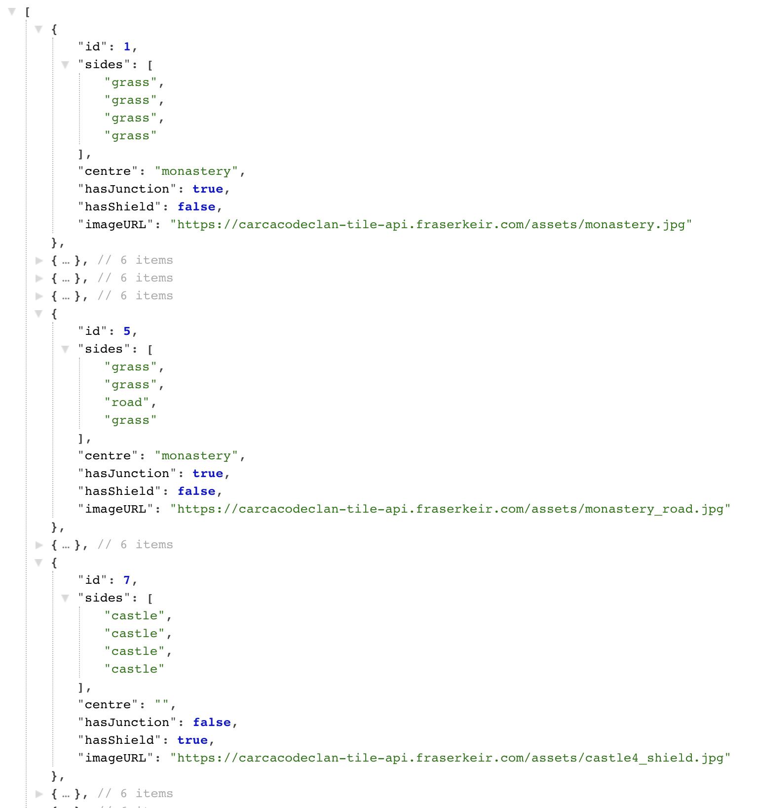
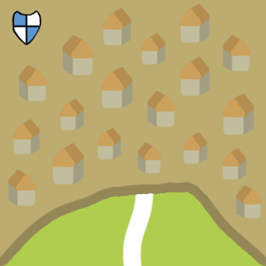
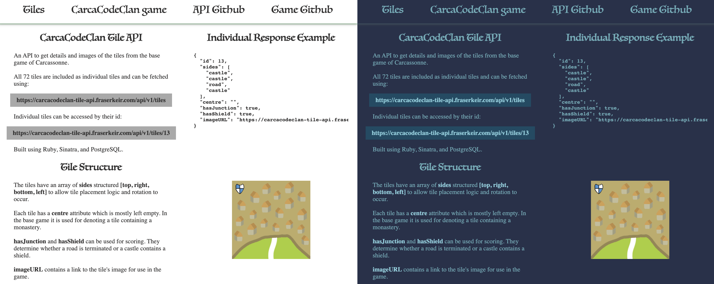

## CarcaCodeClan Tile API

[Check out the API](https://carcacodeclan-tile-api.fraserkeir.com)

This API was created to host and share the game tiles created for the Vue.js game: [Carcassonne clone](https://carcacodeclan.fraserkeir.com). The github repo for that project can be found [here](https://www.github.com/fmkeir/CarcaCodeClan).

The API was built with Ruby, Sinatra, and PostgreSQL using RESTful routes (GET and SHOW). The tiles are added to the database using a server side seeds file. Shown below is the output for a GET request containing the 72 tiles in the base game with a few example tiles.


 

### Getting started

#### Project setup
Install required modules, create and seed database.

```
bundle install
createdb tiles
ruby db/seeds.rb
```

#### Using the project

Host the app locally using Sinatra, defaults to port 4567.

```
ruby server.rb
```

### Tile Structure



The tiles have an array of sides structured [top, right, bottom, left] to allow tile placement logic and rotation to occur.

Each tile has a centre attribute which is mostly left empty. In the base game it is used for denoting a tile containing a monastery.

hasJunction and hasShield can be used for scoring. They determine whether a road is terminated or a castle contains a shield.

imageURL contains a link to the tile's image for use in the game.

```JSON
{
	"id": 13,
	"sides": [
		"castle",
		"castle",
		"road",
		"castle"
	],
	"centre": "",
	"hasJunction": true,
	"hasShield": true,
	"imageURL": "https://carcacodeclan-tile-api.fraserkeir.com/assets/castle3_road_shield.jpg"
}
```

### Automatic dark mode



The homepage of the API is available in light and dark modes. The styling uses a media query to detect the preferred display mode of the user.

```css
@media (prefers-color-scheme: dark) {  }
```

### Interesting code snippets

#### Recurring save for tiles
Many of the tiles in the base game are used multiple times. To simplify the seeds file, a recurring save method was used.

Method:

```ruby
  def recurring_save(times_to_save)
  times_to_save.to_i.times do
    self.save()
  end
```

Method used in the seeds.rb file:

```ruby
tile0 = Tile.new({
  "side_0" => "grass",
  "side_1" => "grass",
  "side_2" => "grass",
  "side_3" => "grass",
  "centre" => "monastery",
  "has_junction" => true,
  "has_shield" => false,
  "image_url" => "https://carcacodeclan-tile-api.fraserkeir.com/assets/monastery.jpg"
  })
tile0.recurring_save 4
```
#### Tile Schema
A tile schema is used to convert the Ruby tile objects into JSON. The methods allow for converting a single tile (SHOW) and multiple tiles (GET).

```ruby
class TileSchema
  def self.format(tile)
    return tile_hash = {
      "id" => tile.id,
      "sides" => tile.get_sides,
      "centre" => tile.centre,
      "hasJunction" => tile.has_junction == "t",
      "hasShield" => tile.has_shield == "t",
      "imageURL" => tile.image_url
    }
  end

  def self.dump(tile)
    return self.format(tile).to_json
  end

  def self.dumps(tiles)
    results = tiles.map {|tile| self.format tile}
    return results.to_json
  end
end
```

#### Content type formatting

This method checks the path and changes the content type to JSON if it is a request to the API. This allows the homepage to be displayed correctly as HTML.

```ruby
before do
  pass if request.path_info.split('/')[1] != "api"

  response.headers['Access-Control-Allow-Origin'] = '*'
  content_type :json
end
```


### Features
* Read: Tile features and images for all 72 tiles in the base game
* Tile schema created to convert Ruby objects into JSON
* Project is structured to enable the addition of expansions and future versions
